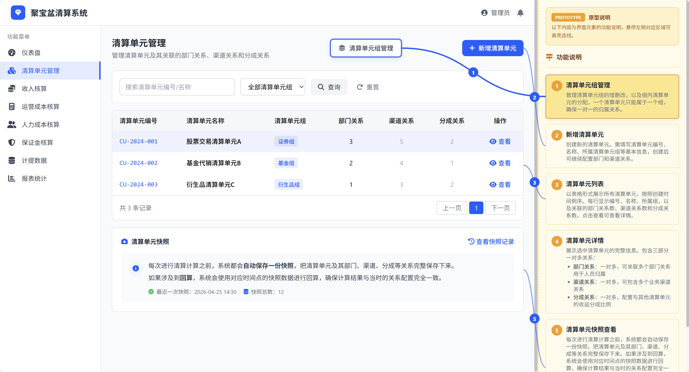

# 让产品经理告别"画原型噩梦"：一个能听懂人话的 HTML 原型生成 Skill

## 一、产品经理的原型之痛，你中了几条？

作为产品经理，画原型是我们绕不开的日常。但这个过程，往往充满了各种令人抓狂的瞬间：

**"工具学习成本太高了"**
Axure 功能强大，但上手门槛高，动态面板、中继器、变量交互让人头大；Figma 协作方便，但国内网络不稳定，而且团队成员不一定都能熟练操作。很多时候，我们想快速验证一个想法，却在工具操作上耗费了大半时间。

**"静态原型缺乏说服力"**
用 PPT 或 Word 贴几张截图，开发同事根本 get 不到交互逻辑。你说"点击这里弹窗"，他理解成"跳转新页面"；你说"悬停显示详情"，他做成了"点击展开"。文字描述和视觉呈现之间，总隔着一层厚厚的"认知墙"。

**"写 PRD 和画原型是两件割裂的事"**
好不容易画完了原型，还得重新写一遍 PRD 文档。原型是原型，文档是文档，开发看原型不看文档，看文档又找不到对应的原型位置。两边维护，双倍工作量。

**"跨设备展示总是出问题"**
在电脑上看着好好的原型，到客户会议室一投影就变形；在手机上打开，按钮小到点不到。响应式适配？那是前端工程师的事，跟产品经理没关系——直到老板问你"手机上怎么看不了"为止。

如果你也有这些困扰，那么这个 `prototype-html` skill 可能会成为你工作流里的一个"秘密武器"。

---

## 二、这个 Skill 是什么？

`prototype-html` 是一个专门面向产品经理的 AI Skill，它的核心能力很简单：**你描述产品需求，它直接生成一个可交互的单文件 HTML 原型页面。**

不需要安装任何软件，不需要学习复杂的设计工具，甚至不需要联网（生成后本地打开即可）。你只需要像跟同事沟通一样，用自然语言描述你想要的界面和功能，AI 就会帮你输出一个完整的、可直接在浏览器中运行的 HTML 文件。

### 它长什么样？

生成的原型页面采用经典的**左右分栏布局**：

- **左侧（80%-85% 宽度）**：展示产品的真实界面——包括导航菜单、表格、按钮、表单、弹窗等所有 UI 元素。
- **右侧（15%-20% 宽度）**：用琥珀色的说明区，展示对应功能点的详细文档说明。

两侧之间通过**SVG 贝塞尔曲线**相连，鼠标悬停在左侧元素上，连线和右侧说明会同时高亮；悬停在右侧说明上，左侧对应元素也会高亮。这种"指哪打哪"的视觉关联，让原型和文档第一次真正融为一体。

---

## 三、它能解决什么问题？

### 1. **零门槛出原型——有嘴就行**

你不再需要花时间学 Axure 或 Figma。只要你会描述需求，就能出原型。

比如你说："我要一个后台管理系统，左侧有菜单栏，包含仪表盘、用户管理、订单管理。主内容区是一个用户列表，有搜索框、新增按钮，表格展示用户的姓名、手机号、状态和操作列。"

这个 skill 就能生成对应的完整页面，包括交互逻辑。

### 2. **原型即文档——一份产出，双重价值**

传统工作流里，原型和 PRD 是分开的。而这个 skill 生成的页面，**左侧是原型，右侧就是文档**。每个功能点都有编号连线对应，开发同学看原型就能同时看到功能说明，不用再在两个文件之间来回切换。

更妙的是，当你向领导或客户演示时，这个页面本身就是最好的"演示材料"——界面和说明一目了然，连最不懂技术的人也能看懂。

### 3. **真交互，不是假把式**

生成的原型不是静态图片，而是有真实交互的：
- 按钮有 hover 效果和点击反馈
- 表格行可以选中高亮
- 弹窗（Modal）可以真正打开和关闭
- 移动端支持视图切换

这让原型在评审会上更有说服力——开发能看到"点了这个按钮确实会弹窗"，而不是想象。

### 4. **一次生成，全设备可用**

PC 端展示时左右分栏，体验完整；手机端自动切换为上下布局，连线隐藏，提供"切换视图"按钮在"纯界面"和"界面+说明"之间平滑过渡。你不需要为不同设备分别做原型。

### 5. **单文件，零依赖**

所有代码（HTML + CSS + JavaScript）整合在一个文件里，通过 CDN 引入 Tailwind CSS 和 Font Awesome。你只需要一个浏览器就能打开，发给同事、客户、开发，双击即用，无需安装任何环境。

---

## 四、它是怎么工作的？——使用方式

这个 skill 的使用非常直观，遵循"四步走"的工作流程：

### 第一步：描述需求
像跟产品经理同事沟通一样，告诉 AI 你要做什么样的产品。可以包括：
- 产品类型（后台管理系统、移动端 H5、数据可视化大屏等）
- 页面结构（导航、侧边栏、主内容区、底部操作栏等）
- 核心功能模块（列表、表单、图表、弹窗等）
- 特殊要求（配色、品牌色、特定交互方式等）

### 第二步：AI 自动设计布局
AI 会规划左侧界面元素与右侧说明文档的对应关系，选择 2-4 个最重要的功能点建立**连线标注**。这些连线不是装饰，而是帮助观者快速建立"界面元素 ↔ 功能含义"的认知映射。

### 第三步：生成完整 HTML 代码
AI 输出一个可直接运行的单文件 HTML，包含：
- 基于 Tailwind CSS 的现代 UI 样式
- Font Awesome 图标
- SVG 动态连线（自动计算位置，窗口 resize 时自适应）
- 完整的交互逻辑（模态框、表格选中、hover 效果等）

### 第四步：打开即用，按需微调
把 HTML 文件保存到本地，双击用浏览器打开即可查看效果。如果需要调整细节，可以直接修改代码，或者用自然语言告诉 AI "把搜索框放到右边"、"换个蓝色主题"等，重新生成。

---

## 五、谁最需要这个 Skill？

| 人群 | 使用场景 |
|------|----------|
| **产品经理** | 快速产出可交互原型用于需求评审，减少与开发的沟通成本 |
| **项目经理** | 给客户演示产品方案时，拿出一份"能点的原型"比 PPT 更有冲击力 |
| **创业者/独立开发者** | 没有设计师资源，用最低成本验证产品想法 |
| **B端业务顾问** | 给甲方展示系统改造方案，原型+说明一体的展示形式更专业 |

---

## 六、写在最后

产品经理的核心价值，在于发现需求和定义方案，而不是把时间耗在工具操作上。

`prototype-html` 这个 skill 的妙处在于，它用一种"极致朴素"的方式解决了产品经理的核心痛点：**用最低的成本、最快的速度，产出最有说服力的原型。** 你不需要成为 Axure 高手，也不需要懂前端代码，只需要会"描述需求"——这本来就是产品经理最擅长的事。

如果你厌倦了在工具里拖拖拽拽，厌倦了原型和文档分家，不妨试试这个 skill。可能你会惊讶地发现：原来画原型，真的可以像说话一样简单。

---

> **一句话总结**：这是一个让产品经理"动动嘴就能出可交互原型"的 AI 技能，生成的单文件 HTML 页面左侧是界面、右侧是文档，带连线高亮和真实交互，PC 和移动端都能用。
